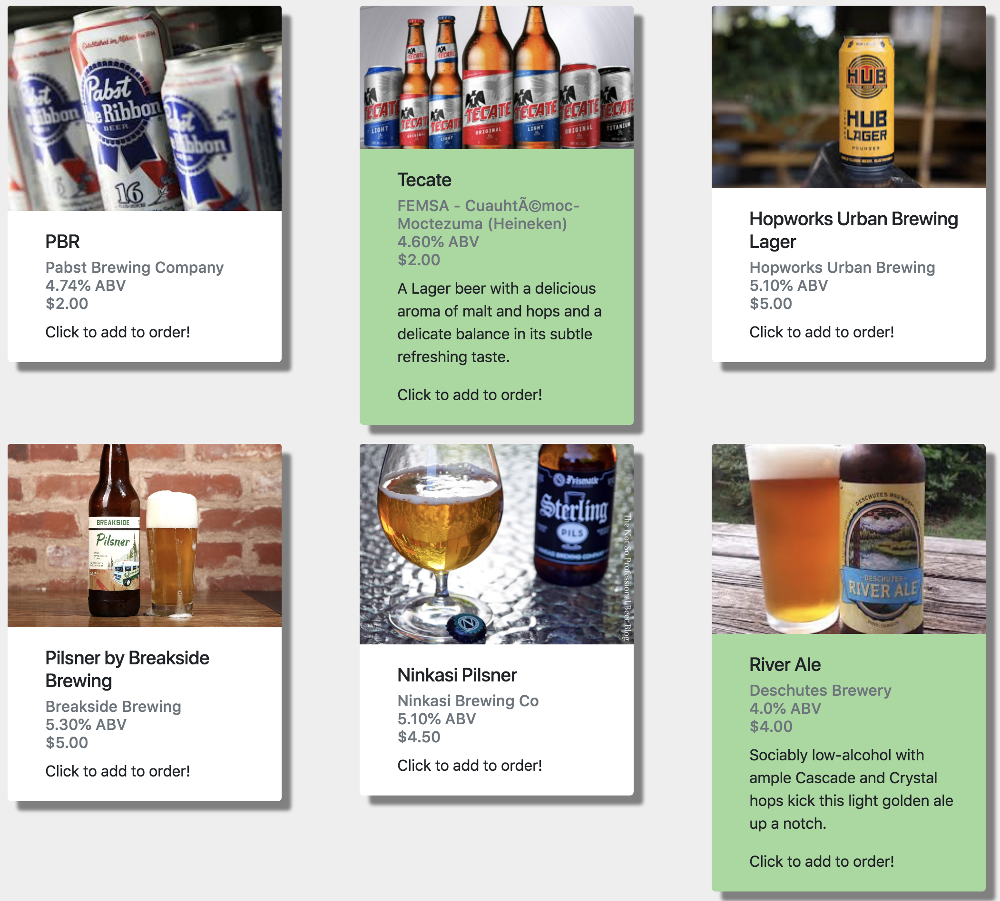

#### By _**Robert Bruce, Rohan Moore, Ngan Nguyen, Chris Rudnicky, Rubin Stricklin**_


## Description

_An app to help people place orders and help businesses maintain an efficient workflow.  barMate provides customers with a way to order drinks without approaching an employee, easing lines and reducing crowding in the main room.  For the bar, it provides a total overhaul of existing workflow, providing clear, easy to read displays to make customer orders intuitive.  When the drink is ready, a button can be pressed to notify the customer without having to leave the bar, reducing work needed to bring drinks across the seating area._

## Setup/Installation Requirements

* _Log in to GitHub_
* _Clone GitHub URL in terminal_
* _Open the html file in your Web Browser_
* _Open file in Atom_

## barMate in Action

<<<<<<< HEAD
<<<<<<< HEAD


=======


>>>>>>> 3360b657682d6f017e33ba5557296a7823215ebb
=======


>>>>>>> 3360b657682d6f017e33ba5557296a7823215ebb

## Specifications

- [x] Create drink object with name and price
````
Input: new Drink("Beer", 7)
Expected Output: [object Drink]
````

- [x] Create order/ticket/tab
````
Input: new Order(name, age, phone number)
Expected Output: order = {name, age, phone number, price, drinkArray}
````

- [x] Add drinks to order
````
Input: order.addDrink(new Drink)
Expected Output: Order.drinkArray = [Drink]
````

- [x] Remove drinks from order
````
Input: order.removeDrink(name)
Expected Output: order.drinkArray = []
````

- [x] Calculate order total
````
Input: order.totalCost
Expected Output: "$5"
````

- [x] Add order to ticketList
````
Input: ticketList.addOrder(order)
Expected Output: ticketList.tickets = [order]
````

- [x] Remove order from ticketList
````
Input: ticketList.addOrder(order)
Expected Output: ticketList.tickets = []
````

- [x] Signal when order is ready
````
Input: ticketList.readyTicket(order)
Expected Output: readyList.tickets = [order]
````

- [x] Create TicketManager object to handle interacting with pending and ready orders
````
Input: var ticketManager = new TicketManager()
Expected Output: ticketManager = {TicketList, TicketList}
````

- [x] Add functions to modify pending tickets in accordance with previous specs
````
Input: ticketManager.readyTicket(order), ticketManager.addOrder(order), ticketManager.addOrder(order)
Expected Output: readyList.tickets = [order], ticketList.tickets = [order], ticketList.tickets = []
````

- [x] Write ticket contents to HTML upon changes
````
Input: ticketManager.writeTicketList()
Expected Output: lists of pending and ready orders in the HTML
````

- [x] Everytime page content is generated, clear previous html contents first
````
Input:  TicketManager.clearTicketLists
Expected Output: $("#ticketList").html(""); $("#readyList").html("");
````

- [x] Provide button to move an order from pending list to ready list
````
Input:  a ready button of an order is clicked
Expected Output: move object from pending list to ready list
````


- [x] Provide button to remove an order from pending list
````
Input:  a remove button of an order is clicked
Expected Output: remove object from pending list  
````

## Technologies Used
_GitHub, HTML, CSS, Bootstrap, Javascript, JQuery_

### License
<<<<<<< HEAD
<<<<<<< HEAD
Copyright (c) 2018 **_RB RS RM NN CR_** GNU General Public License 3.0
